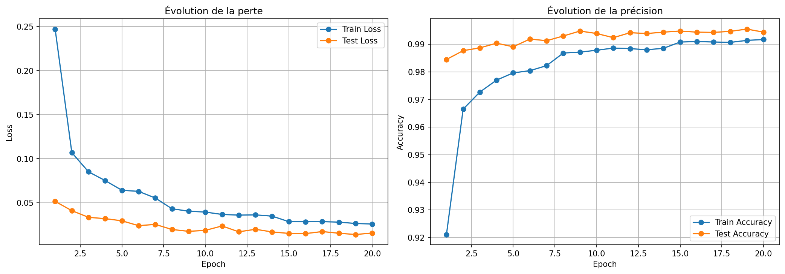
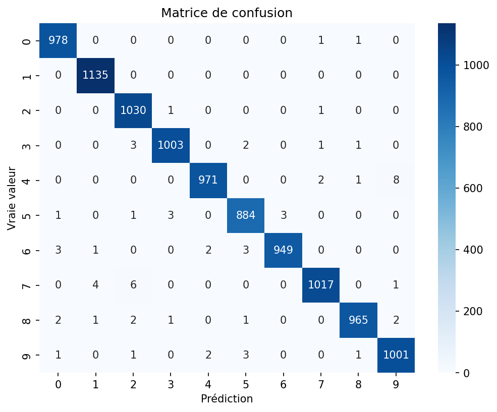

# MNIST CNN — Reconnaissance de chiffres manuscrits avec PyTorch by Faozane YENOU, Paterne SIMBA, Honorat ASSOGBA and Mario DATONDJI

Implémentation à partir de zéro d'un réseau de neurones convolutionnel (CNN) pour classifier les chiffres manuscrits du dataset MNIST, sans utiliser de modèle pré-entraîné. Ce projet a pour but de démontrer une maîtrise complète des briques fondamentales du deep learning : convolutions, pooling, couches denses, et boucle d'entraînement manuelle.

## Résultats obtenus à l'issue de l'entrainement

- **Précision** : **99.44 %**
- **Perte (loss)** : 0.0230
- **Nombre d'Epoques d'entrainement** : 10
- **Nombre de paramères** : **421,834**




Les erreurs de classification restantes concernent surtout des confusions attendues entre chiffres visuellement proches (4 ↔ 9, 7 ↔ 2), typiques de l'écriture manuscrite.

## Architecture du modèle

On a utilisé une architecture classique et simple à deux blocs convolutionnels suivis de deux couches entièrement connectées :

```
Input (1, 28, 28)
  → Conv2d(1 → 32, kernel=3, padding=1) → ReLU → MaxPool2d(2)   [32, 14, 14]
  → Conv2d(32 → 64, kernel=3, padding=1) → ReLU → MaxPool2d(2)  [64, 7, 7]
  → Flatten                                                      [3136]
  → Linear(3136 → 128) → ReLU → Dropout(0.25)
  → Linear(128 → 10)
```

Toutes les couches (`nn.Conv2d`, `nn.MaxPool2d`, `nn.Linear`) sont définies et assemblées manuellement dans un module `nn.Module` structuré.

## Structure du dépôt

```
mnist-cnn-pytorch/
├── README.md
├── requirements.txt
├── src/
│   ├── model.py       # Définition de l'architecture SimpleCNN
│   ├── dataset.py      # Chargement et transformations des données MNIST
│   ├── train.py        # Boucle d'entraînement et évaluation
│   └── evaluate.py     # Visualisations (courbes, matrice de confusion, exemples)
├── outputs/
│   ├── mnist_cnn.pth            # Poids du modèle entraîné
│   ├── training_curves.png
│   └── confusion_matrix.png
└── notebook_exploration.ipynb   # Notebook Colab original (exploration pas à pas)
```

## Installation

```bash
git clone https://github.com/'votre username ici'/mnist-cnn-pytorch.git
cd mnist-cnn-pytorch
pip install -r requirements.txt
```

## Utilisation

**Entraîner le modèle :**
```bash
python src/train.py
```
En procédant comme ça, vous allez télécharger automatiquement MNIST (via `torchvision.datasets`), entraîner le modèle sur 10 époques, et sauvegarder les poids dans `outputs/mnist_cnn.pth`.

**Évaluer et visualiser les résultats :**
```bash
python src/evaluate.py
```
Cette commande charge le modèle entraîné et génère les courbes d'entraînement, la matrice de confusion et des exemples de prédictions.

## Détails techniques

- **Framework** : PyTorch (+ torchvision pour le chargement du dataset uniquement)
- **Optimiseur** : Adam, learning rate = 0.001
- **Fonction de perte** : CrossEntropyLoss
- **Batch size** : 64
- **Régularisation** : Dropout (p=0.25) pour limiter le sur-apprentissage
- **Normalisation** : moyenne/écart-type standards de MNIST (0.1307 / 0.3081)

## Auteurs

Projet réalisé par Faozane YENOU, Paterne SIMBA, Mario DatonDJI and Honorat ASSOGBA dans le cadre du cours *Machine Learning 2*.
